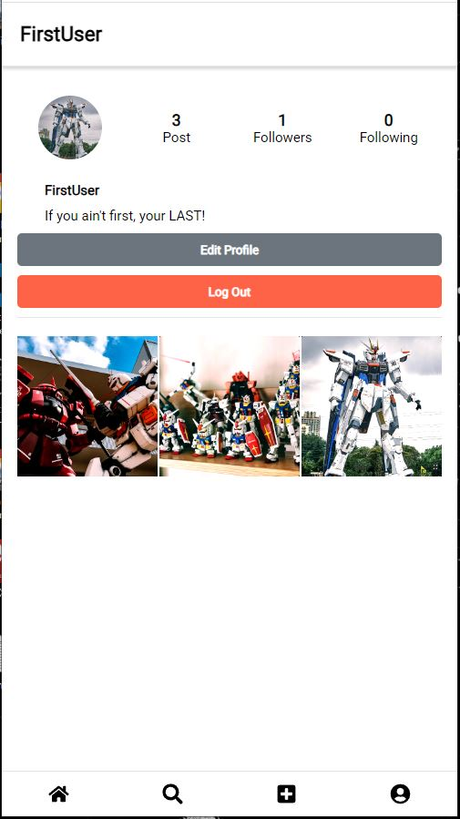

# TheOdinProject - Project: JavaScript Final Project

This is a solution to the [JavaScript Final Project]https://www.theodinproject.com/lessons/node-path-javascript-javascript-final-project
## Table of contents

- [Overview](#overview)
  - [The challenge](#the-challenge)
  - [Test Account](#test-account)
  - [Screenshot](#screenshot)
  - [Links](#links)
- [My process](#my-process)
  - [Built with](#built-with)
  - [What I learned](#what-i-learned)
  - [Continued development](#continued-development)
  - [Useful resources](#useful-resources)
- [Author](#author)

## Overview

### The challenge

- Replicate your favorite website and have 80% of it's functionality
- Use firebase to host the backend

### Test account
Please use the account information below, if you do not want to create one to check user login UI.

Email: testuser1@instaclone.com
PW: test123

### Screenshot




### Links

- Solution URL: [https://github.com/TheLegend760/Instaclone-TheOdinProject]
- Live Site URL: [https://thelegend760.github.io/Instaclone-TheOdinProject/]

## My process

### Built with

- Semantic HTML5 markup
- CSS custom properties
- Flexbox
- Mobile-first workflow
- [React](https://reactjs.org/) - JS library
- [Styled Components](https://styled-components.com/) - For styles
- [React Icons] - https://www.npmjs.com/package/react-icons
- [MaterialUI] - https://mui.com/
- [React Image Crop] - https://www.npmjs.com/package/react-image-crop
- [HTML-to-image] - https://www.npmjs.com/package/html-to-image


### What I learned

I learned a lot by creating this project to writing down on how the layout of the website will work and how till the functions will work together. For example I thought that it would be more effective to upload post data on both userPost and mainPagePost, instead of having to fetch data from the whole userPost via handlePostUpload. I was not aware that I can pass components on Context Providers. I also learned how you can pass variables and functions within the context provider using destructuring, which I provided an example on via CommentModalProvider. Using async functions on useEffect was pretty difficult, I had to scatter the web and look up videos on how it worked. I figured out that youhad to create the aysnc function inside useEffect and run it with if statement, below is the example.

```js
    const handlePostUpload = async(e) => {
        e.preventDefault()

        setIsLoading(true)
        const postRef = doc(db, 'userPost', userID)
        const mainPagePostRef = doc(db, 'mainPagePost', 'post')
        const generateUID = uuidv4()
        const generatePostId = generateUID.slice(0,8)

          try {
            const storageRef = ref(storage, displayName + '/' + generatePostId)
            uploadString(storageRef, upImg,'data_url').then((snapshot) => {
              getDownloadURL(storageRef)
              .then(async(url) => {
                // Adds post object on user post
                await setDoc(postRef, {
                  [generatePostId]: {
                    postID: generatePostId,
                    displayName: displayName,
                    posterUID: userID,
                    userPhotoURL: user.currentUser.photoURL,
                    imgURL: url,
                    description: textValue,
                    comments: '',
                    likes: [],
                    timestamp: serverTimestamp(),
                  }
                }, {merge: true})
              // adds postid to mainpage post
              await updateDoc(mainPagePostRef, generatePostId, {
                  postID: generatePostId,
                  displayName: displayName,
                  posterUID: userID,
                  userPhotoURL: user.currentUser.photoURL,
                  imgURL: url,
                  description: textValue,
                  comments: '',
                  likes: [],
                  timestamp: serverTimestamp(),
              })
              // after upload is done navigate home
              navigate('/')
              })
              .catch((error) => {
                setShowErr(true)
                setIsLoading(false)
              });
            });
        } catch(error) {
          setShowErr(true)
          setIsLoading(false)
        }
      }

    const CommentModalProvider = ({children}) => {
    const [showComments, setShowComments] = useState(false)
    const [postData, setPostData] = useState()

    const handleShowCommentModal = (postdata) => {
        setPostData(postdata)
        setShowComments(true)
    }

    const handleExitCommentModal = () => {
        setShowComments(false)
        setPostData(null)
    }

    return (
        <CommentModalContext.Provider value={{showComments, postData, handleShowCommentModal, handleExitCommentModal}}>
            
                {
                    showComments ?
                    <CommentModal />
                    :
                    null
                }
                {children}
        </CommentModalContext.Provider>
    )
}

useEffect(() => {
    // Grabs userPost and user data from firebase
    const getMainUserData = () => {

      const unsub = onSnapshot(doc(db, 'users', authUser.currentUser.uid), (doc) => {
        const userValue = doc.data()
        handleMainUserData(userValue)
      })

      const unsub2 = onSnapshot(doc(db, 'userPost', authUser.currentUser.uid), (doc) => {
        // converts object data into array
        const postValue = doc.data()
        if(postValue) {
          const postValueArray = Object.entries(postValue)
          // sorts the array by newest first
          const sortPostByTime = postValueArray.sort(function(x,y) {
          return y[1].timestamp - x[1].timestamp })
          handleMainUserPostData(sortPostByTime)
        } else {
          handleMainUserPostData(null)
        }
      })

      return () => {
        unsub()
        unsub2()
      }
    }
    
   if(authUser.currentUser && !mainUserData) {
    getMainUserData()
   } else return

  }, [authUser.currentUser, handleMainUserData, handleMainUserPostData, mainUserData, mainUserPostData])
```


### Continued development

I would like to learn more of the backend and how I can make websites without limits that firebase puts. I would also like to do more testing, since I did live testing using functions inside the components. 

### Useful resources

- [Youtube - Lama Dev](https://www.youtube.com/watch?v=k4mjF4sPITE&t=3477s) - This video helped me create the idea of how I can implement his firebase video to my instagram clone website.
- [Firebase](https://firebase.google.com/docs) - This website allowed me to figure out the ins and outs of using firebase with my project.

## Author

- GitHub - [Legend760](https://github.com/TheLegend760)
- Email - [Kevin David](kevin760g@gmail.com)
